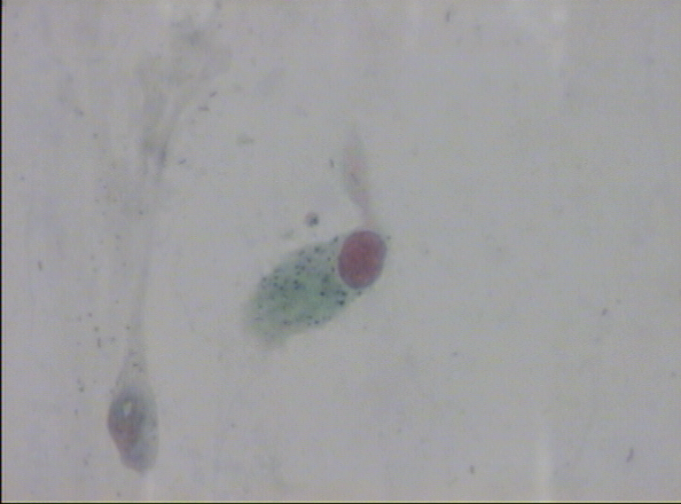
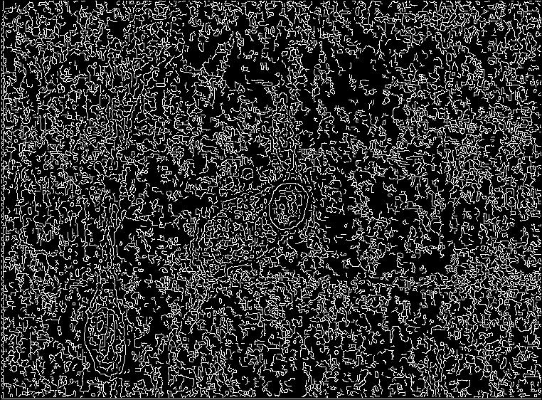
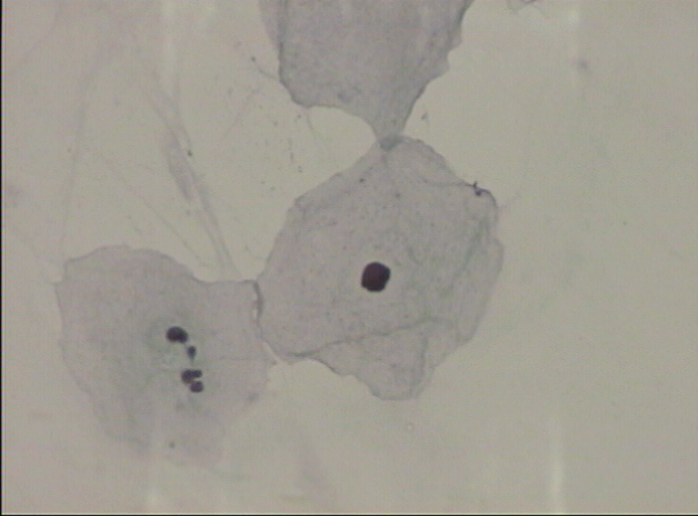
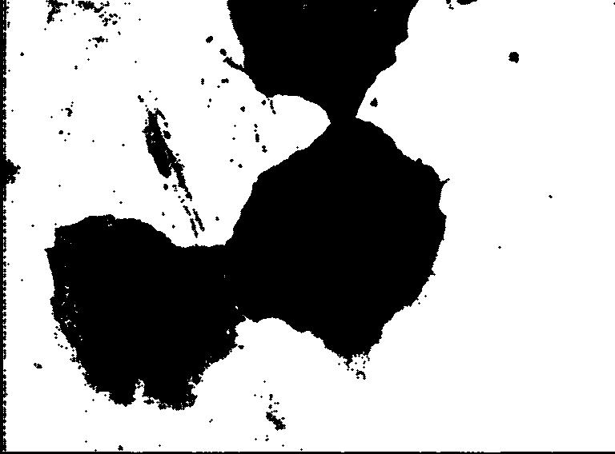
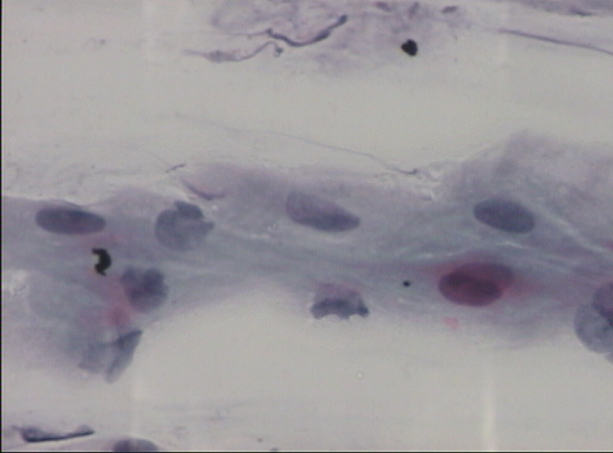
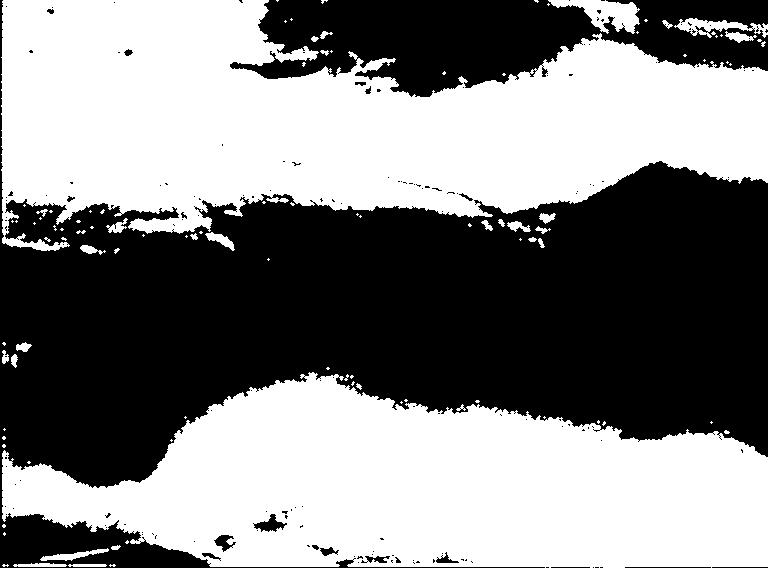
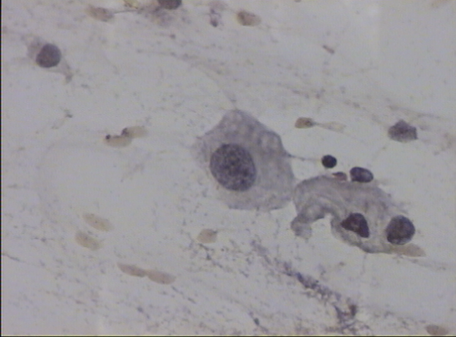
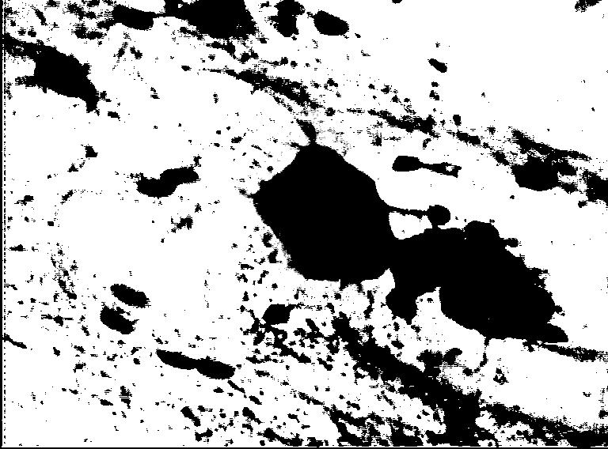
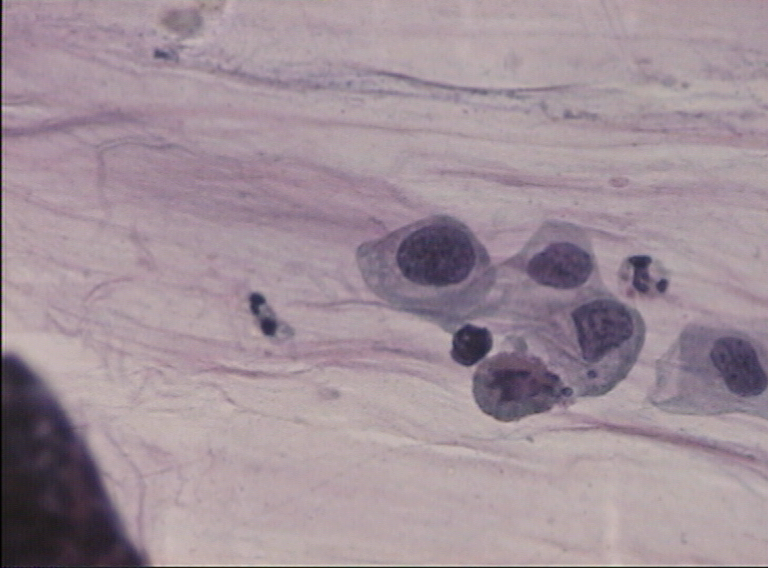

# Image Analysis - Part1

## Overview

* Take a batch of images as input. 
* Run the operations on each image
    * Grey Scaling Salt and Pepper Noise, Gaussian Noise, Linear Filtering, Median Filtering, Histogram Calculations, Histogram Equalization, Image Quantization, and Mean Squared Error). 
* All of these operations output a new image for each image in the batch. 
* A TOML file for configuration of attributes like noise and the weights for filters.

## Usage

```
git clone https://github.com/praveenarallabandi/ImageAnalysis.git
cd ImageAnalysis
pip3 install --user pipenv
python ImageAnalysisPart1.py
```

## Implementation

The project implementation is done using Python. Using Python, we can rapidly develop and integrate each operation. Python's NumPy library, which allows for array operations. 

Certain image array operations are time-consuming, and those scenarios were addressed with optimizing NumPy arrays (using NumPy methods as much as possible) and with numba. Numba is an open-source JIT compiler that translates a subset of Python and NumPy code into fast machine code. Numba has a python function decorator for just-in-time compiling functions to machine code before executing. Using this decorator on functions that use heavy math and looping (i.e., filters and noise) provides significant speed increases with speeds similar to using lower-level compiled languages like C/C++ or Rust. For plotting histograms, Python's `matplotlib,` the relatively standard and robust plotting library, outputs plots to a file with the rest of the exported output images.

## Dependencies 

* numpy - For Array operations
* matplotlib - Plot
* numba - JIT for speed exectuion
* toml - Configuration settings
* PIL (Image) - Used only for importing and exporting images

 ## Functions

```python
def calculateHistogram(image: np.array) -> np.array:
```
`calculate_histogram` Generates the histogram, equalized histogram, and quantized image based on the equalized histogram

```python
def image_quantization_mse(image: np.array, imageQuant: np.array, imageName: str) -> float:
```
 `image_quantization_mse` Calculates mean square error for two input images

```python
def convertToSingleColorSpectrum(image: np.array, colorSpectrum: str) -> np.array:
```
`convertToSingleColorSpectrum` Generates the NumPy array for a single color spectrum.

```python
def corruptImageGaussian(image: np.array, strength: int) ->  np.array:
```
`corruptImageGaussian` Generates image with gaussian noise applied

```python
def corruptImageSaltAndPepper(image: np.array, strength: int) -> np.array:
```
`corruptImageSaltAndPepper` Generates image with salt and pepper noise applied

```python
def linearFilter(image, maskSize=9, weights = List[List[int]]) -> np.array:
```
`linearFilter` Receives a kernel or matrix of weights as a two-dimensional input list and applies that kernel to a copy of an image. The filter is then applied in loops through each pixel in the image and multiples the neighboring pixels' values by the kernel weights. The larger the kernel, the larger the pixel's neighborhood that affects the pixel. 

```python
def medianFilter(image, maskSize=9, weights = List[List[int]]):
```
`medianFilter` The median filter is applied to the input image, and each pixel is replaced with the median value of its neighbors. The current pixel value as well is included in the median calculation.

## Results

The output images are stored in output directory, mean square errors for each image is printed on stdout alsong with performance metrics
Below is th snapshop of output


# Image Analysis - Part2

# CMSC 630 Project 2

### Image Segmentation and Clustering

## Overview

The program takes a batch of images as input and runs a given set of operations on them (Edge Detection, Histogram Clustering, Histogram Thresholding, Dilation, and Erosion). All of these operations output a new image for each image in the batch. A TOML file in the source code's root directory is used to configure the operations, such as the strength of noise and the weights for filters. All critical functions are implemented from scratch except for array operations that use the third-party mathematics library `NumPy.` 

### Usage

    git clone https://github.com/jonaylor89/image-segmentation.git
    cd image-segmentation
    pip3 install --user pipenv
    pipenv install
    pipenv run python segmentation.py

## Implementation

The programming language of choice for this project was python. The high-level reason for deciding to write everything in python was that it gives the ability to rapidly develop and integrate each operation and python's `numpy` library, which allows for idiomatic and fast array operations. Python's fairly obvious downside is its speed. To mitigate the problem of speed for the image operations, `numba` , a third-party python library used for mathematics, is being used. `numba` has a python function decorator for just-in-time compiling functions to machine code before executing. Using this decorator on functions that use heavy math and looping (i.g. convolving) provides major speed increases with speeds similar to using lower-level compiled languages like C/C++ or Rust. Compilation time effects the first image in the batch, but every image after that uses the precompiled machine code. Image batches, rather than being operated on synchronously, are thrown into a process pool where a preconfigured number of worker processes pulls images off a queue and runs them through the operation pipelines. 

**Full Third-Party Dependency List**

    # Pipefile
    [packages]
    pillow = "**"     # reading and writing images
    numpy = "**"      # fast array operations
    *click = "**"      # command line interface utility
    numba = "**"      # just-in-time compiler for operations
    toml = "**"       # reading configuration file
    tqdm = "*"       # progress bar

*These can be found in the Pipfile at the root of the source code*

---

## Results

The output of this program can be seen in two places. The first is in the output directory specified in the `toml` configuration file. In the output directory, there are the grayscale images from each operation with the file name `{operation}_{original image}.BMP` (e.g. `edges_svar53.BMP`).

    canny_edge_detection(img_array: np.array) -> np.array



Original



After Edge Detection

    dilate(img_array: np.array, win: int = 1) -> np.array



original



Segmented and Dilated

    erode(img_array: np.array, win: int = 1) -> np.array



original



Segmented and Eroded

    histogram_thresholding(img_array: np.array) -> np.array



original



segmented

    histogram_clustering(img_array: np.array) -> np.array

---



original


segmented