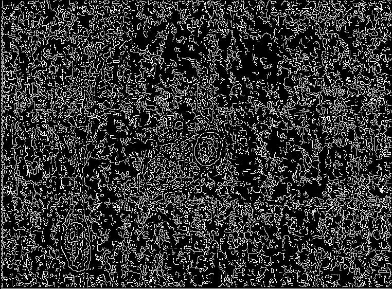
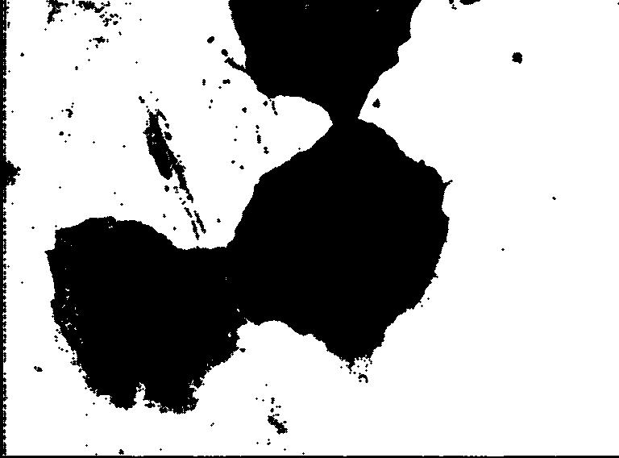
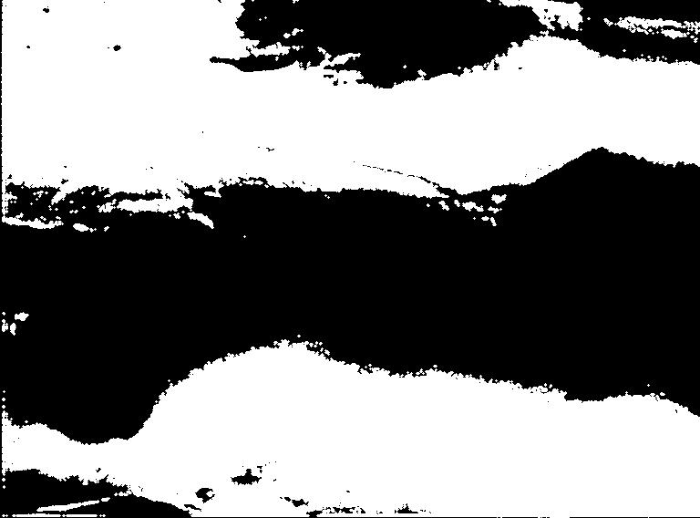
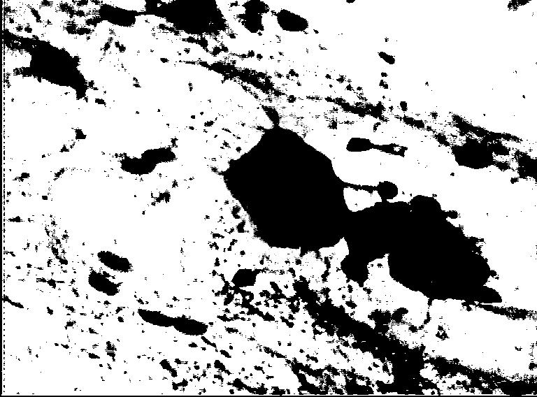
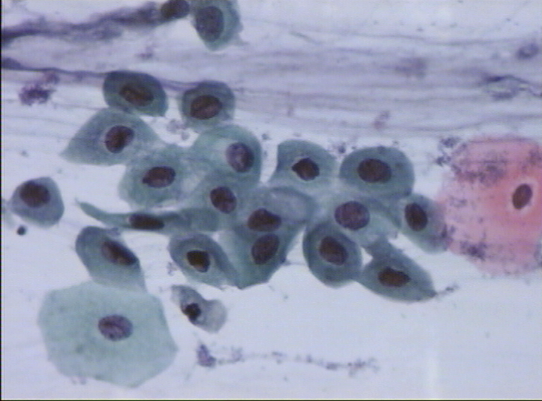
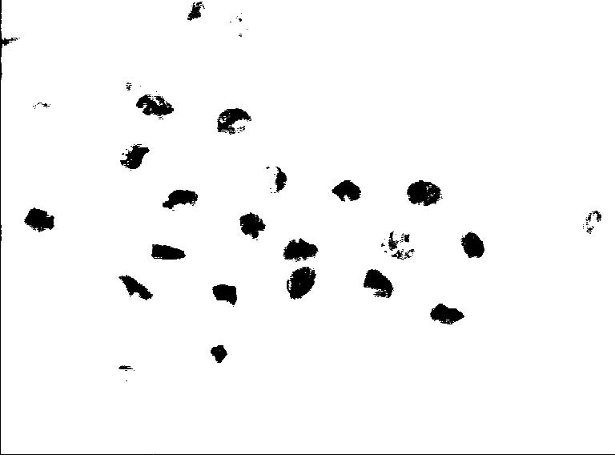
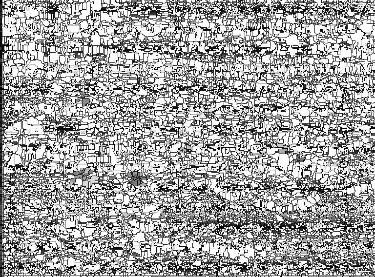

# Image Analysis - Part2

### Image Segmentation and Clustering

## Overview

The program takes a batch of images as input and runs a given set of operations on them (Edge Detection, Histogram Clustering, Histogram Thresholding, Dilation, and Erosion). All of these operations output a new image for each image in the batch. A TOML file in the source code's root directory is used to configure the operations, such as the strength of noise and the weights for filters. All critical functions are implemented from scratch except for array operations that use the third-party mathematics library `NumPy.` 

#### Usage

    git clone https://github.com/jonaylor89/image-segmentation.git
    cd image-segmentation
    pip3 install --user pipenv
    pipenv install
    pipenv run python segmentation.py

## Implementation

The programming language of choice for this project was python. The high-level reason for deciding to write everything in python was that it gives the ability to rapidly develop and integrate each operation and python's `numpy` library, which allows for idiomatic and fast array operations. Python's fairly obvious downside is its speed. To mitigate the problem of speed for the image operations, `numba` , a third-party python library used for mathematics, is being used. `numba` has a python function decorator for just-in-time compiling functions to machine code before executing. Using this decorator on functions that use heavy math and looping (i.g. convolving) provides major speed increases with speeds similar to using lower-level compiled languages like C/C++ or Rust. Compilation time effects the first image in the batch, but every image after that uses the precompiled machine code. Image batches, rather than being operated on synchronously, are thrown into a process pool where a preconfigured number of worker processes pulls images off a queue and runs them through the operation pipelines. 

**Full Third-Party Dependency List**

    # Pipefile
    [packages]
    pillow = "**"     # reading and writing images
    numpy = "**"      # fast array operations
    *click = "**"      # command line interface utility
    numba = "**"      # just-in-time compiler for operations
    toml = "**"       # reading configuration file
    tqdm = "*"       # progress bar

*These can be found in the Pipfile at the root of the source code*

---

## Results

The output of this program can be seen in two places. The first is in the output directory specified in the `toml` configuration file. In the output directory, there are the grayscale images from each operation with the file name `{operation}_{original image}.BMP` (e.g. `edges_svar53.BMP`).

#### EDGE DETECTION
```python
def cannyEdgeDetection(img_array: np.array) -> np.array
```
|  | 
|:---:|:---:|
| Original | Edge Detection |

#### DILATION
```python
def dilate(img_array: np.array, win: int = 1) -> np.array
```
|  |  |
|:---:|:---:|
| Original | Dialtion |

#### Erosion
```python
def erode(img_array: np.array, win: int = 1) -> np.array
```
|  |  |
|:---:|:---:|
| Original | Erosion |

#### Segmentation - Histogram Thresholding
```python
def histogramThresholding(img_array: np.array) -> np.array
```
|  |  |
|:---:|:---:|
| Original | Segmentation - Histogram Thresholding |

#### Segmentation - Clustering (k-means)
```python
def histogramClustering(img_array: np.array) -> np.array
```
|  |  |
|:---:|:---:|
| Original | Clustering (k-means) |

#### Additional Algorithm - Watershed Segmentation
```python
class Watershed(object)
```
|  |  |
|:---:|:---:|
| Original | Watershed Segmentation |
